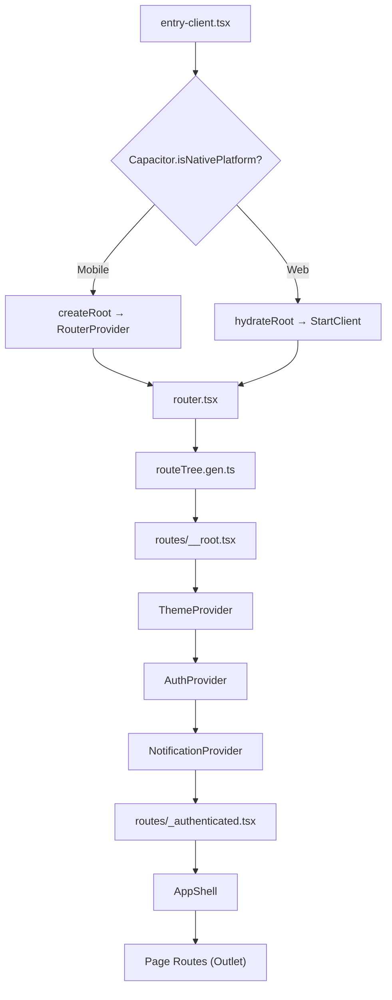
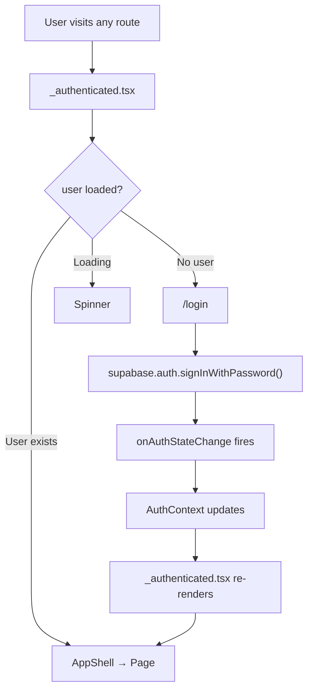
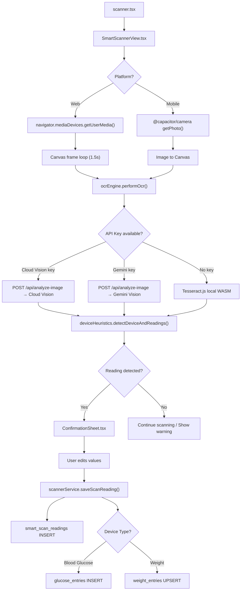
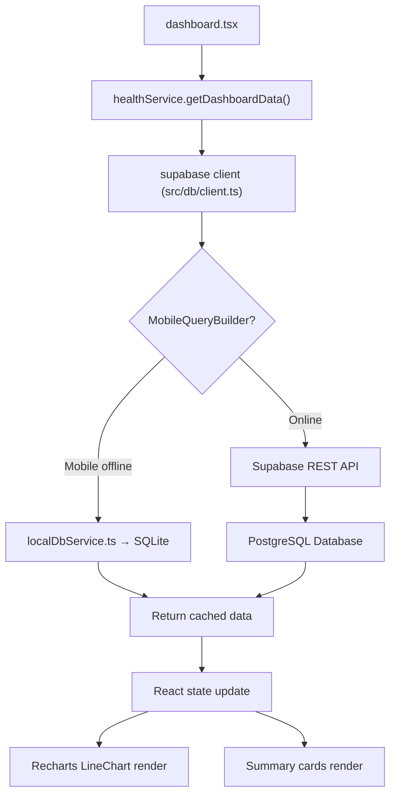
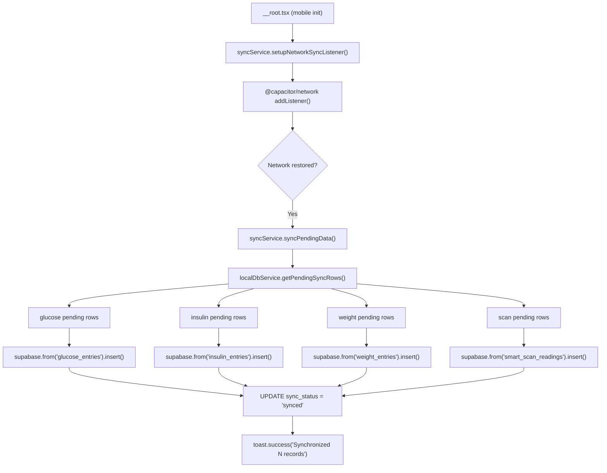
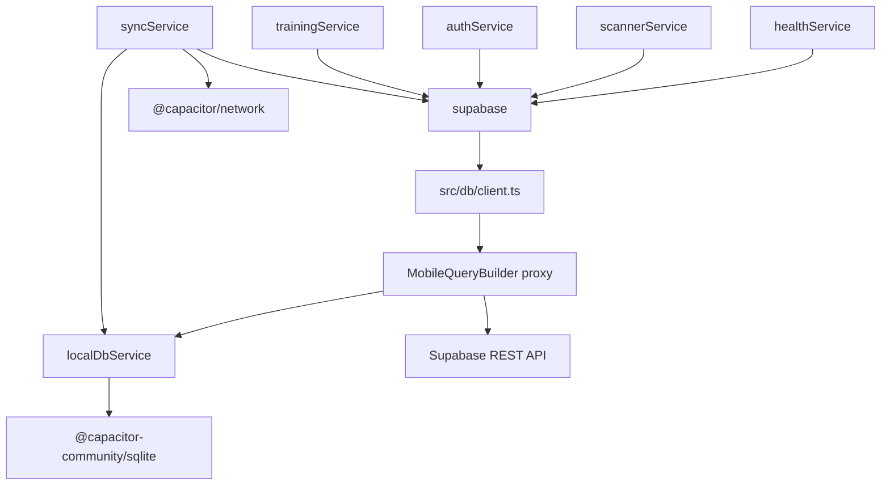
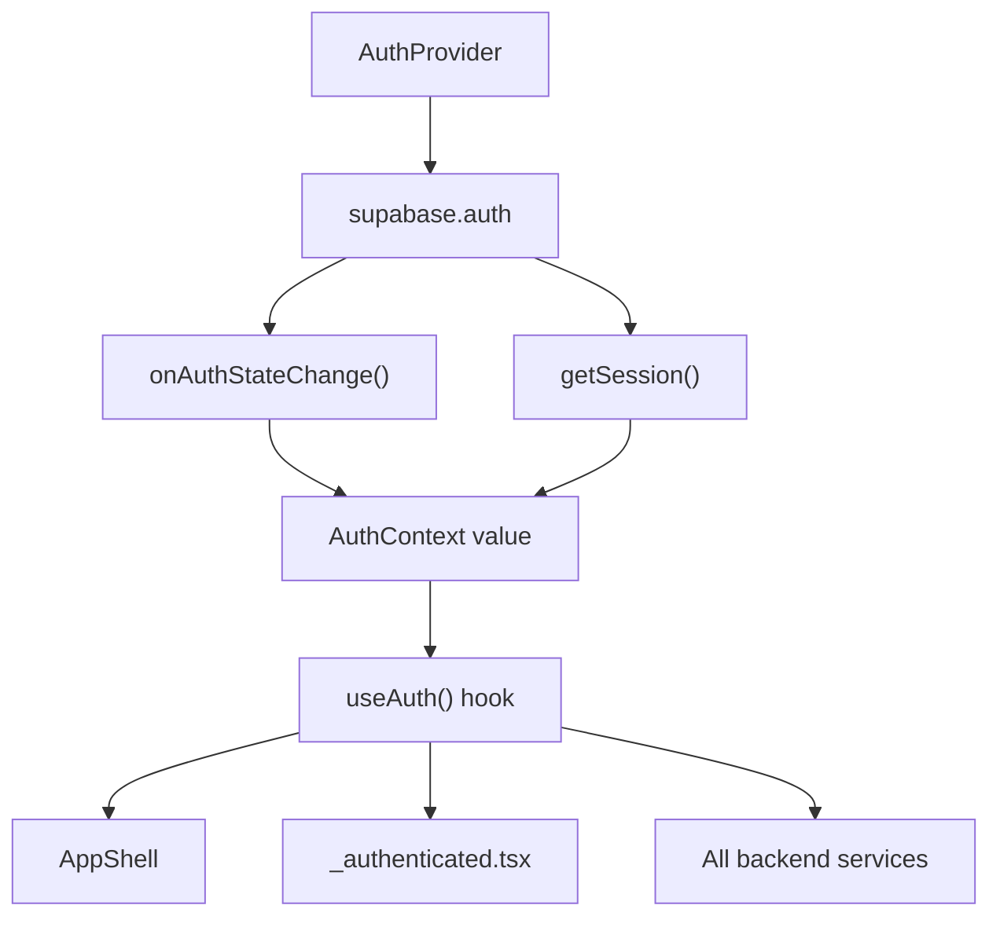
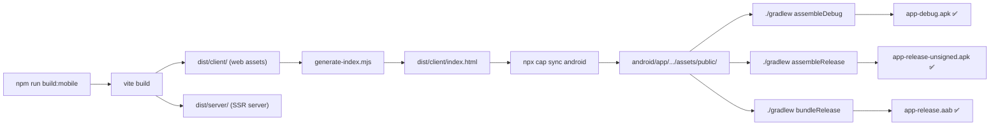

# 📊 DEPENDENCY_GRAPH.md — GlucoLab Dependency Maps

> **Last Updated:** 2026-06-26  
> Mermaid diagrams for all major dependency relationships.

---

## Application Bootstrap

---

## Authentication Flow

---

## Smart Scanner Pipeline

---

## Dashboard Data Flow

---

## Offline Sync Flow

---

## Component Dependencies

```mermaid
graph TD
    AppShell --> useAuth
    AppShell --> useTheme
    AppShell --> useNotifications
    AppShell --> StatusBar["@capacitor/status-bar"]
    AppShell --> Haptics["@capacitor/haptics"]
    
    Dashboard --> healthService
    Dashboard --> GlucoseDialog
    Dashboard --> InsulinDialog
    Dashboard --> WeightDialog
    Dashboard --> ProfileDialog
    Dashboard --> Recharts
    
    GlucoseDialog --> reactHookForm["react-hook-form"]
    GlucoseDialog --> zod
    GlucoseDialog --> Dialog["ui/dialog"]
    
    SmartScannerView --> ocrEngine
    SmartScannerView --> deviceHeuristics
    SmartScannerView --> imageFilters
    SmartScannerView --> useGlucoseScanner
    SmartScannerView --> Camera["@capacitor/camera"]
    SmartScannerView --> ConfirmationSheet
    
    ConfirmationSheet --> scannerService
    
    ocrEngine --> Tesseract["tesseract.js"]
    ocrEngine --> analyzeImage["/api/analyze-image"]
    
    analyzeImage --> CloudVision["Google Cloud Vision API"]
    analyzeImage --> Gemini["Gemini Vision API"]
```

---

## Service Layer Dependencies

---

## Authentication Context Dependencies

---

## Build Pipeline Dependencies

